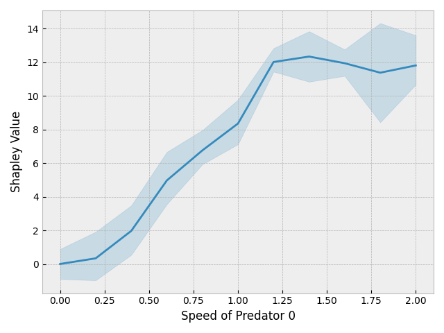
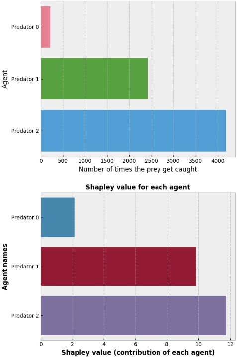
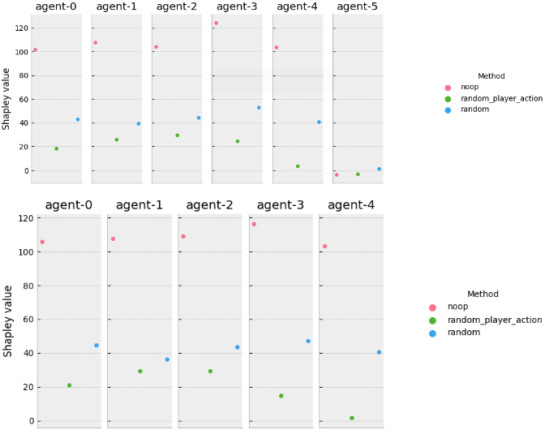
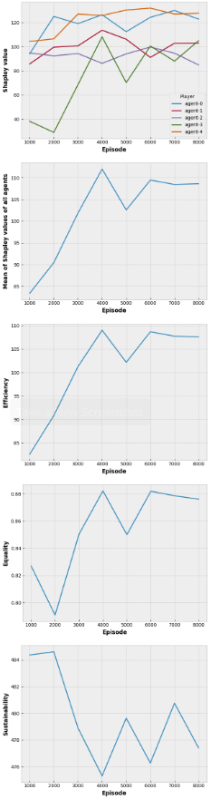

# XAI-in-RL

## About

Explaining RL multiagent environments by computing Shapley values.
This is the official implementation of [Collective eXplainable AI: Explaining Cooperative strategies and agent contribution in Multiagent Reinforcement Learning with Shapley Values](https://ieeexplore.ieee.org/document/9679742) (available on [arxiv](https://arxiv.org/abs/2110.01307)). 

Experiments were conducted for two environments: [Sequential Social Dilemmas](https://github.com/eugenevinitsky/sequential_social_dilemma_games) and [OpenAI's Multiagent Particle](https://github.com/openai/multiagent-particle-envs).
The implementation for each environment is available in the corresponding subfolder.

## Installation

See Readme in subfolders. Instructions will be given for each env to reproduce the experiments presented in the article.

To use any of the pre-configured Python environments, you need [Conda](https://docs.conda.io/projects/conda/en/latest/user-guide/install/).

## Experiments

There is a unified API to launch and configured experiments for both environments.
For each environment, you need to go to the `experiments` subfolder to launch the experiments:

```bash
cd multiagent-particles/experiments
```
```bash
cd sequential_social_dilemmas_games/experiments
```

To launch an experiment, you must place your models in the `saves` (for Multiagent Particle) or `models` (for Sequential Social Dilemmas) directory.
Several pretrained models have already been placed (TODO: rename model folders).

If you do not have a pre-trained model, you can train a new one with default settings using this command:

```bash
python run.py
```

To launch experiments with the provided models and reproduce the paper's results, use the following command:

```bash
python launch_experiments.py 
```

To get help and a list of all arguments (to configure the environment and the experiments) you can add `--help` after any of the two commands above.

## Plots

Once the experiments have been ran, it is possible to plot different diagrams using the following command:

```bash
python plots.py rewards --plot_type your_plot_type
```
`plot_type` can be one of:
- `model_rewards` for plotting global rewards obtained during training phase by a model. It is required to give the model location with `--model_dir your_model_dir`.
- `shapley_barchart` for plotting a barchart featuring the Shapley value of each agent computed using a specific player exclusion method. The player exclusion method must be given as argument with `--exclusion_method`, it can be one of `noop`, `random` or `random_player`.
- `shapley_cat_plot` for plotting a categorical plot featuring the Shapley value of each agent for each model used to run the experiments


## Results

### Multiagent Particle



(Prey-Predators env, variable agents speeds) Plot ofthe Shapley value obtained (on 1,000 sample episodes) by a single MADDPG predator agent versus its speed. It is clearly visible  that  the  agent’s  Shapley  value  grows  proportionally with its speed. As a faster predator can obviously catch more often the prey, this fact supports the claim that Shapley values correlate with agents contributions to the common goal.




(Prey-Predators  env,  variable agents speeds) The upper plot shows predator agents performance comparison for 10,000 sample episodes and 5 trained models  (2,000  sample  episodes  for  each  of  the  five  trained models) while the bottom plot present Shapley values obtained(on  1,000  sample  episodes)  for  each  predator  agent  for  oneof the 5 models with *noop* player exclusion method. Thehigh  numbers  of  models  and  sample  episodes  are  designed to counteract the stochastic nature of MADDPG. Making the predators’ speed vary created a clear hierarchy between themand, in the bottom plot, Shapley values accurately reflects this performance distribution.


### Sequencial Social Dilemmas



(Harvest env) The upper plot presents Shapley valuesobtained (on 1,000 sample episodes) for each harvest agent using each of the three agent substitution methods. The bottom plot  also  features  Shapley  values  computed  with  the  same settings but with Agent 5 deactivated. The same settings were used for all agents. *noop* player exclusion method is the only one free from scoring negative cumulated reward due to random actions and thus is the most likely one to lead to Shapley values close to the agents’ real contributions.




Evolution of the Shapley values and social metrics from [Perolat et al.](https://arxiv.org/pdf/1707.06600.pdf) over different training episodes. From top to bottom are displayed, the Shapley values (*noop* action selection method;MC estimation with M=500), the mean of those Shapley valuesof all agents, the efficiency metric, the equality metric and the sustainability metric.

## Paper Citation

If you use our work in your article, please cite the following paper:

```bibtex
@ARTICLE{9679742,  author={Heuillet, Alexandre and Couthouis, Fabien and Díaz-Rodríguez, Natalia},  journal={IEEE Computational Intelligence Magazine},   title={Collective eXplainable AI: Explaining Cooperative Strategies and Agent Contribution in Multiagent Reinforcement Learning With Shapley Values},   year={2022},  volume={17},  number={1},  pages={59-71},  doi={10.1109/MCI.2021.3129959}}
```


